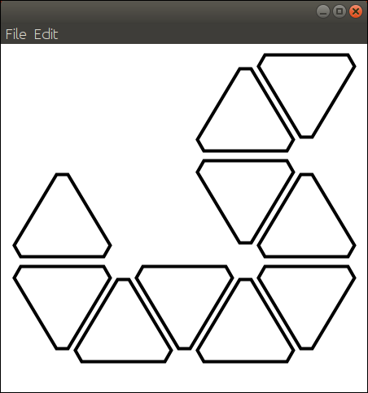
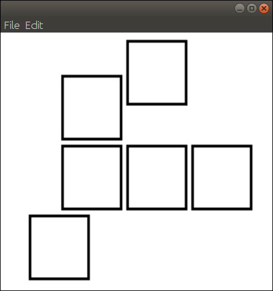

# Nanoleaf Simulator
This is a simple simulator for the Nanoleaf Aurora and Canvas made to help developers with testing their code. The simulator does not support api endpoints related to dynamic or rhythm effects. External streaming however **is** supported.

## Usage
The simulator can be interfaced with in exactly the same way as a physical Nanoleaf device through the [OpenAPI.](https://forum.nanoleaf.me/docs/openapi) However, the simulator will not broadcast it's address to other applications. The default <b>HTTP port for the simulator is 7144</b> and the default UDP (used for external streaming) port is 7143.

Assuming you are running the simulation locally, you can first make a GET request to http://localhost:7144/api/v1/new which will return an API key. You do not have to demonstrate physical access to the simulator like you would on a physical device. Keys are stored locally in the simulator until cleared manually. Once you have an API key, you can make other API calls normally as http://localhost:7144/api/v1/&lt;endpoint&gt;.

## Screenshots




## Changing the Layout
Right now, layouts are defined in files with the .nleaf extension in plain text that use the following format. You may define as many panels as you like.
```
type <Aurora/Canvas>
panel <id> <x> <y> <orientation>
panel <id> <x> <y> <orientation>
panel <id> <x> <y> <orientation>
...
```
You may define as many panels as you like in this format. See [example.nleaf](example.nleaf) and [example2.nleaf](example2.nleaf) for examples.

If I ever get around to it I will probably add an editor feature to allow the panels to be added/removed and rearranged within the simulator.
